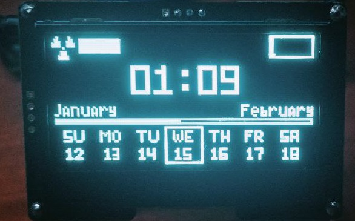
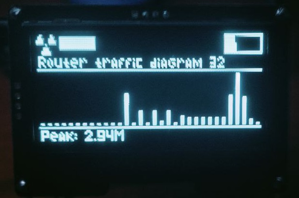

# AxiusPanel
 
Настольная информационная панель на esp8266. Работает на ядре [Axius](https://github.com/P-R-A-Y/Axius) с использованием 128x64 2.4-дюймового дисплея на драйвере SSD1306

Проэкт еще на стадии разработки поэтому на убогое оформление прошу не пиздеть
## Фичи
Используется для отображения:
- Даты/Времени
- Состояния домашнего сервера сервера
- Потребление трафика в виде диаграммы
- Данные о подключении (ipv4/6, аптайм соединения, мак адрес)
В планах добавить отображение:
- Погоды
- Температуры и влажности в комнате
- Данные о подключеных клиентах
- Информирование по кастомному протоколу о дате и времени для всех устройств на ядре Axius в радиусе действия
- Информацию о моем майнкрафт сервере
На данный момент обновлять не могу, так как нода изза старости и корозии от окислений отказывается отвечать на команды в сериал порт и даже вручную не вводится в режим прошивки. Но зато вроди пока еще работает. Других у меня нет, так что тестировать код негде. Новая нода уже едет с китая, так что скоро разработка продолжится

## Рецепт крафта
- NodeMCU v3
- 128x64 OLED дисплей размером 2.4 дюйма
- Проволока 0.3-0.5 мм для эстетичной организации проводки
- Какие нибудь тонкие металлические палки (например разрезаные скрепки)
- Паяльник/припой
- Руки из жопы
- Набор всяких модулей по желанию
Порядок действий:
- Закидываем все предметы на верстак
- Читаем заклинание автокрафта во имя Шивы
- Строим зиккурат x1
- Взмахиваем пару раз волшебной палочкой(паяльником)
- Готово✅✅✅✅✅
Также, чтобы наша панелька могла общаться с роутером (подойдет только кинетик), нужно открыть порт, по которому будет доступно API роутера без авторизации. Да, проще было бы сделать SSH соединение но еспшка слишком слабая для криптографии.

Итак, настроить переадресацию порта нужно следующим образом:
Вход: 
- IP: 192.168.0.0
- Маска: 255.255.255.0 (24)
- Порт: 81 (необязательно прям такой, но лучше его чтобы небыло конфликтов)
Выход:
- Должен вести в локальную сеть
- Порт: 79
- Протокол: TCP
## Предистория создания
У меня валялась ненужная нода которая была в полумертвом состоянии в связи с тем что попала под воду и не годилась для использования, а выкидывать было жалко. На мысль о создании меня сподвигли пикчи из пинтереста с какими то хуйнями на голых esp8266 навесным монажом под стиль спутников которые пускают на марс. Ну значит почистил пару окисленных контактов чтобы хотябы дисплей подключить. Для изготовления супер эстетик💅 корпуса, нужна была проволока 0.8мм, но дома к сожалению ее небыло, пришлось заюзать креативчик и раскусать ненужные скрепки. Изза их толщины получилось чучуть по уебански но в целом так даже лучше и прочнее
## Фоточки

Главный экранчик с датой, временем и шкалой прохождения месяца

Диаграмма с информацией о потреблении трафика

Моя жалкая попытка в эстетику и навесной монтаж:

